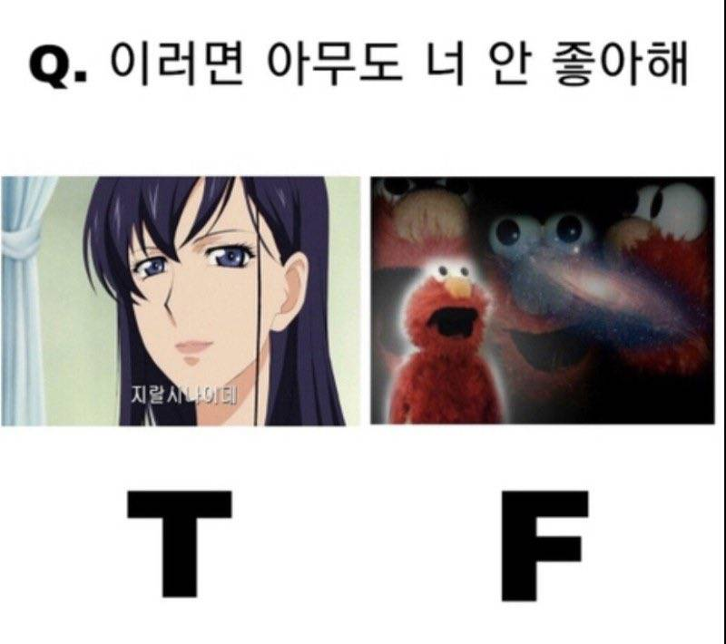
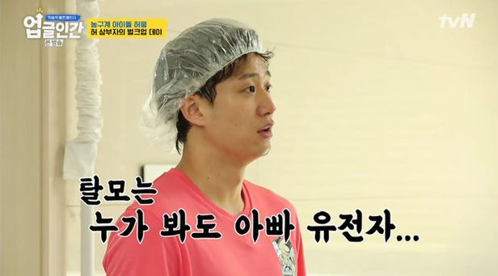
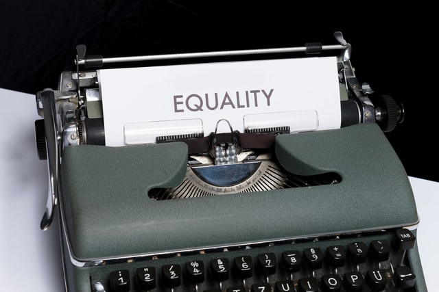
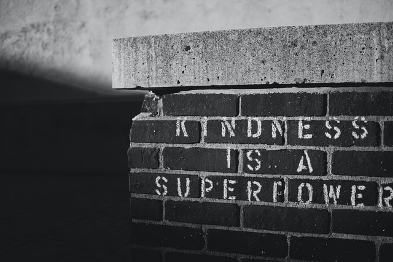

## 책을 읽게 된 동기

모든 사람들이 "착해빠져서는 이 험난한 세상을 살아갈 수 없단다" 라는 말을 마치 어느 위인의 격언마냥 가슴 속에 새겨두고 사는 지금 같은 시대에서 나는 "친절함은 무기다"라는 생각을 견지하고 있다.

내가 이런 생각을 가지고 있는 이유는 도덕적 우월감이나 종교적 신념같은 추상적인 이유가 아니라 진짜 이게 잘 먹힌다고 생각하기 때문이다.(~~물론 매번 잘 먹히는 건 아니지만~~)

그래서 이 책을 통해서 내가 가진 생각과 자세가 합리적이고 타당한 것인지, 만약 그렇다면 어떤 이유에서 그런 것인지 알고 싶어서 읽게 되었다.

---

## 공감의 방식

요즘 사람들을 만날 때 자기 MBTI 모르고 만나면 대화에 낄 수 없다는 말이 과언이 아닐 정도로 MBTI는 많은 사람들의 관심사이다. 그리고 그 중에서도 **F** 유형과 **T** 유형에 대한 밈이 정말 끝도 없이 만들어지고 소비되는 중이다.

이러다 보니 종종

> 넌 F니까 잘 이해해 줄 거야!  
> 넌 F라면서 왜 이런 것도 못 받아줘?
또는
> 넌 T니까 날 이해 못해!  
> 원래 T들은 이과 감성이야! (~~무분별한 이과혐오 멈춰!~~)

와 같은 말들을 심심찮게 듣거나 말하게 된다.

이런 대화는 공감을 잘 한다고 여겨지는 **F**유형도, 유사 기계 취급을 받는 **T**유형도 모두 달가워하지 않는 내용의 대화이다.  

나는 이런 대화가 발생하는 이유를 이 책을 펼치고 몇 장 안 넘기고 바로 찾을 수 있었다.

> 대부분의 사람은 공감이 그 자체로 하나의 감정이라고 생각한다. '내가 당신의 고통을 느끼는 것'이니 말이다. 하지만 공감은 그보다 더 복잡하다.  
> 사실 '공감'이란 사람들이 서로에게 반응하는 몇 가지 방식을 말한다.   
> 다른 사람들이 어떤 감정을 느끼는지 인지하는 것(**인지적 공감**), 그들의 감정을 함께 느끼는 것(**정서적 공감**), 그들의 경험을 개선하고 싶은 마음(**공감적 배려**)이 바로 그 방식들이다.

사람들이 일반적으로 생각하는는 공감은 "정서적 공감"일 것이다.  하지만 공감은 정서적 공감 외에도 다른 방식이 존재하기에 같은 사물/현상을 대할지라도 사람마다 공감을 표현하는 방식이 다를 수 있는데, 우리는 정서적 공감이 아닐 때는 "공감하지 못한다"고 치부하는 것 같다.

이 책에서 얻은 첫 번째 값진 지식은, 가뜩이나 **공감이 파괴된 시대**에서 공감의 범주를 축소시켜 타인을 유사 인간 취급하는 실수를 범하지 않을 근거로 잘 써먹을 수 있을 것 같다.

---

## 고정주의와 유동주의

> 공감 능력은 선천적인 것인가, 후천적으로 늘거나 줄어들 수 있는 것인가?

이 책은 정말 오랜 시간을 할애하여 이 부분을 설명하고 있다. 
정확히 말하면, 공감 능력에 대한 고정주의와 유동주의 입장과 인간이 능동적으로 공감 능력을 기르거나 줄이는 현상과 방식에 대해서 열심히 설명하고 있다.

결론만 먼저 말하면, 
### **"공감 능력은 후천적으로 개발 또는 억제가 가능하다"**

책에서 든 예시들을 내 멋대로 정리해보면,

- \- 사람은 자신이 처한 상황에 따라 공감 능력을 조절한다
- \- 사람은 자신과 같은 (사상,유전,기호 등) 집단의 대상에게 더 높은 공감 능력을 발휘한다
- \- 사람의 공감 능력은 자신이 만나는 사람, 접한 지식, 처한 환경 등으로 인해 발달될 수 있다
- \- 사람의 공감 능력은 예술, 문학, 연극 등을 통해 길러질 수 있다

정도로 요약해볼 수 있다. 
(~~빠트린 게 한 뭉탱이인 것 같지만 그건 미래의 내가 다시 이 책을 읽어봐서 알아내는 걸로 하자~~)

물론, 사람들이 공감 능력에 대해 바라보는 시각에는 고정주의와 유동주의가 엄연히 존재하며, 그 시각과 별개로도 공감 능력의 발달/퇴화 정도는 개개인마다 편차가 존재하기도 하다.

하지만 우리가 상식적이라고 생각하는 "oo한 사람은 공감을 잘 못해" 라는 표현이나 "미안 나는 공감같은 거 못하는 사람이야" 라는 말은 타인을 가두는 프레임이거나 자기 자신을 위해 찾는 궁색한 변명에 불과하다는 사실만은 분명한 것 같다.

---

## 증오와 접촉

> 진정한 증오는 연결의 심각한 결여이다.  
> 다른 사람의 고통은 물론이고, 나 자신의 고통과도 연결될 수 없다.

어느 인종차별주의자였던 사람이 자신의 삶을 회고하면서 한 말이다.

이 책을 읽으면서 정말 기억에 남는 문장이었는데,  
이 문장이 기억에 남았던 이유는 **'사실 증오에 빠진 이는 자기 자신마저 구제하지 못하는 상황에 처해 있는 중이다'** 라는 생각을 가지게 해줘서였다.

모종의 이유로 증오의 둘레 속에 자신을 가둔 사람은 타인 뿐만 아니라 자신마저 고립시켜, 주변 사람들에게 오만 민폐는 다 끼치면서도 행복하지 못하는 모순에 빠져있다는 사실이 내겐 꽤 놀라운 사실이었다.  
그러기에 증오로 가득찬 사람도 어쩌면 사실 그런 상황에서 벗어나고 싶어 할지 모른다는 생각이 들었고, 그러기에 이 세상에 친절이 회복되는 것이 좀 더 가능성 있다는 생각도 함께 들었다.

### 근데 정말 이 사회에 친절이 회복될까?

사실 이 책을 읽으면서 가장 관심 가는 부분이 이 부분이기도 했다

온오프라인을 막론하고 **혐오**가 팽배해있는 요즘같은 시대에서 이 책이 던지는 **친절**이 도대체 가당키나 한 건가 싶은데, 다행히 이 책은 **증오**를 극복하기 위한 방법을 제시하면서 그것이 조금도 쉽지 않다는 사실마저 함께 인정하고 있었다.

특히나 온라인 상에서 일어나는 **혐오**와 **증오**는 이 책이 증오의 해법으로 제시하는 **접촉**이 성립되기 어려운 구조 속에서 벌어지는 일이기에, 현대 사회에서 친절이 회복되는 것은 정말 어려운 일이라는 생각이 들었다.

그럼에도 이 책은 증오를 이겨내고, 한 때 자신이 처했던 고통스러운 처지에 처해있는 다른 이들을 돕기 위해 노력하는 사람들을 소개해주면서, 그 어려운 것이 현실에서 일어나고 있다는 사실을 통해 작지만 밝은 희망을 이야기하고 있었다.

--- 

## 친절이 보상되는 시스템

친절과 공감이 회복되려면 친절한 사람이 보답받고, 공감 능력을 잘 발휘하는 사람이 우대받는 시스템이 있으면 된다.

우리가 흔하게 "여성이 남성보다 공감능력이 뛰어나" 라고 말하지만, 이 책과 이 책을 소개해줬던 팟캐스트에서는 "그건 사회가 남성보다 여성에게 높은 공감능력을 요구해왔기 때문"이라고 말한다.

반대로 미국 경찰이나 의료계 종사자들처럼, 공감과 친절이 역으로 자신의 신체적/정신적 위협으로 돌아오는 순간들을 겪는 사람들은 공감을 포기하는 경향을 보이기도 한다.

이렇듯 사람들은 자신이 처한 상황 속에서 자신에게 유리한 방식으로 공감 능력을 조절하고 있기에, 친절과 공감이 보상되는 건강한 시스템의 구축이 사람과 사람 사이의 유대를 강화하고 서로가 서로를 경계하고 위협하는 상황들을 효과적으로 줄여나가는 해결방안이 될 것이라고 믿는다.

그러기에 이러한 시스템이 생겨나기 위해서 개개인은 자기 자신부터 친절과 공감이 올바르게 보답받을 수 있도록 노력해야 할 것이다.

---

## 감상

어쩌다보니 무슨 공익광고협의회에서나 할법한 말을 잔뜩 써놓은 것 같지만, 이 책을 읽고나서 든 내 솔직한 생각이 이런 것이긴 하다.

**친절이 보상되는 시스템**, 이 시스템이 생기면 그래도 나는 나름 저 시스템에서 득보는 측에 속할 자신이 있어서, 어서 저런 분위기가 조성되었으면 좋겠다.

그래서 사회 전반에 **신뢰의 자본**이 두텁게 쌓여서, 적어도 그런 부분에서 덜 신경쓰고 사는게 게으른 나의 빅피쳐라고 말하고 싶다.

