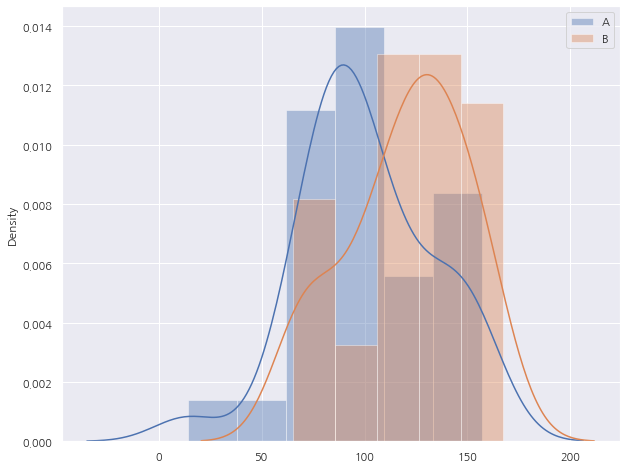

# 순열이란?
<p>

**순열**은 임의의 집합을 다른 순서로 뒤섞는 연산을 일컫는다.<br>
n개의 원소를 가지는 집합으로 만들 수 있는 순열의 개수는 다음과 같다.
$$
n! = n(n-1)(n-2)\cdots2\cdot1
$$

그 중에서 k개의 원소를 가지는 집합의 개수는 다음과 같다.

$$
^n P_r = n(n-1) \cdots (n - k + 1)
$$

---

# 순열검정

<br>
그렇다면 순열검정은 무엇일까?

## 순열검정은 어떨 때 쓰는가?

순열검정은 기본적으로 "**두 집단 간에 차이가 존재하는가?**"를 검증하기 위해 사용되는 방법이다.<br>
유사한 목적으로 활용되는 검증법에는 t-test, ANOVA 등이 있다.

그럼 그 중에서 순열검정을 사용해야 하는 경우는 어떤 경우일까?

일반적으로 순열검정은 **샘플의 수가 충분히 크지 않아서 t-test같은 검정을 진행하기 어려울 때** 채택된다.<br>
순열검정은 비교하고자 하는 두 집단을 하나로 섞은 후 무작위로 추출하여 샘플의 숫자를 늘리는 방식으로 통계적 유의성을 확보하는 검증법이다.

---

아래는 순열검정으로 두 집단 간의 평균 차이가 통계적으로 유의미한지 검증하는 예제 코드이다.

## 예시 코드

### 1) 임의의 두 집단 생성

평균이 100, 표준편차가 30인 정규분포를 따르는 집합 $A$와 평균이 120, 표준편차가 30인 정규분포를 따르는 집합 $B$의 원소를 각각 50개를 랜덤하게 생성한다.

```python
import numpy as np

mu_A, sigma_A = 100, 30
mu_B, sigma_B = 120, 30

A = np.random.normal(mu_A, sigma_A, 50)
B = np.random.normal(mu_B, sigma_B, 50)
```

생성된 두 집합의 평균값과 그 차이를 확인해보면 다음과 같다.

```python
print(np.mean(A), np.std(A))
print(np.mean(B), np.std(B))

obs_diff = np.abs(np.mean(A) - np.mean(B))
print(obs_diff)
```
##### 실행결과
> 100.76158435155538 31.770202634942585 <br>
> 120.29838384013723 28.77745375433396 <br>
> 19.53679948858185



두 집합 모두 기대하는 평균과 표준편차에 근사하는 값을 가지고 있으며, 그로인해 관측된 평균값의 차이 또한 예상한 값인 20과 매우 근사한 것을 확인할 수 있다.

이제 순열검정을 통해 관측된 평균값(*obs_diff*)이 유의미한지 검증해보도록 한다.

### 2) 순열 검정의 p-value 산출하기

```python
n_a, k = len(A), 0
n_i = 10000
diff_ls = []

for i in range(n_i):
    X = np.concatenate((A,B))
    np.random.shuffle(X)
    tmp_diff = np.abs(np.mean(X[:n_a]) - np.mean(X[n_a:]))
    if obs_diff < tmp_diff:
        k += 1
    diff_ls.append(tmp_diff)
```

#### 변수 설명
> *n_a*   : 집합 $A$의 원소 수 <br>
>   (집합 $B$도 같으므로, 이 값은 무작위 추출을 통한 순열 생성 시 추출될 원소 개수가 됨)<br>
> *k*     : 관측된 평균 값의 차이보다 큰 경우가 나타난 횟수<br>
> *n_i*   : 검증을 위한 테스트 횟수 (설정값: 10,000회) <br>
> *diff_ls* : 관측된 평균 값들을 저장할 리스트 (Optional)

#### 실행 순서

1. (1) 집합 $A$와 $B$를 하나의 집합 $X$로 합친다
2. (2) 집합 $X$를 무작위로 섞는다
3. (3) 집합 $X$를 *n_a*개의 원소를 가지는 두 집합으로 나눈다
4. (4) 나눈 두 집합의 평균값의 차이(*tmp_diff*)를 계산한다
5. (5) 계산된 값이 관측된 평균값(*obs_diff*)보다 클 경우, *k*의 값을 1 증가시킨다
6. (6) (1)~(5)를 *n_i*번 반복한다

이렇게 *k* 값이 도출된 후,
$$
k \div n\_i
$$
하면 **p-value**를 도출할 수 있다.

예를 들어, *k*가 150이 나왔다면 **p-value**는
$$
k \div n\_i = 150 \div 10000 = 0.015
$$
가 도출됩니다.

